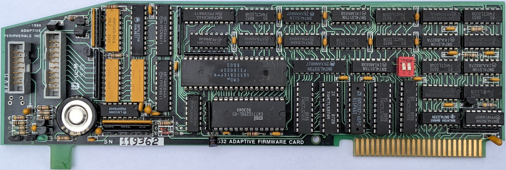
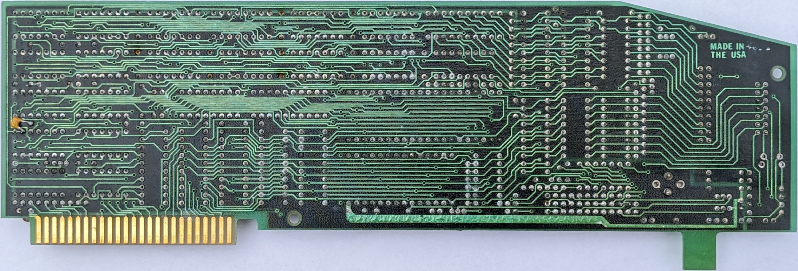

This is a programmable interface card for accessibility peripherals that can read inputs from the
input devices and emulate a keyboard, joystick, or mouse. It contains a dedicated 65C816 16-bit CPU with
32K of RAM to hold the program code. There's a supercapacitor on the board which allows the low power
SRAM to retain the program code for days so that the user doesn't have to boot up the configuration
disk every time the computer is powered on.

Although I believe this card is primarily designed to work on the Apple IIgs (and the only software disk I
found is for the IIgs), when DIP switch 2 is turned on it will pull down a IIgs-specific bus signal so
that the card might also be able to work on an Apple II+ or IIe.

The card connects to an external box which breaks the signals out onto a 36 pin centronics connector.
I don't have the box so I can't determine the connections between the card and that connector. Based
on the pinout of the centronics connector [shown in the manual](https://archive.org/details/AdaptiveFirmwareCardManualAppleIIGS/page/n635/mode/2up)
I don't think the box itself has any significant circuitry in it.

In order to transparently emulate the standard Apple II input devices, the card looks like it has the
ability to trap read & write requests that are directed to I/O memory locations and take them over.
There is dedicated hardware to identify when any (configurable) set of I/O memory addresses are
accessed, stop the IIgs's CPU, and send an interrupt to the card's dedicated CPU for further handling.
The program running on the card could then take over the entire Apple II system using the DMA mechanism
and eventually place a value on the data bus and resume the IIgs's CPU.

The PCB doesn't label any of the components so I've [taken the liberty of assigning identifiers](front_annotated.jpg)
so that the PCB can be cross-references with the schematic.

[Schematic](Schematic.pdf) | [KiCad Project & all artifacts]({{ site.github.repository_url }}/tree/main{{ page.dir }}) | [Manual](https://archive.org/embed/AdaptiveFirmwareCardManualAppleIIGS)

### Front Image

### Back Image

