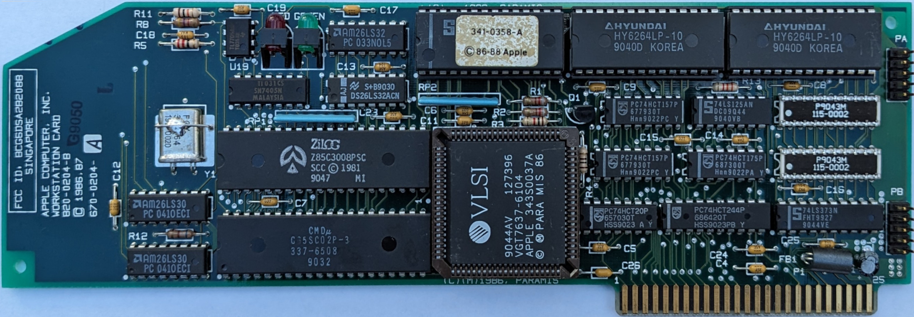
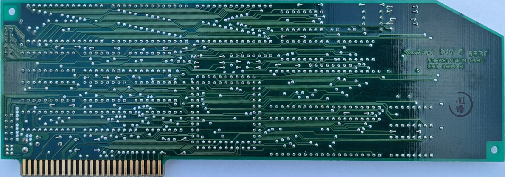

[Schematic](Schematic.pdf) | [KiCad Project & all artifacts]({{ site.github.repository_url }}/tree/main{{ page.dir }})

This card allows an Apple IIe to connect to a LocalTalk network and access AppleShare file servers and shared printers.
The card also allows booting up over the network. It has two RS-422 ports that function like the serial ports on the
Apple IIGS and Macintoshes.

Most of the IC component identifiers are hidden under the chips on the board so I created an
[annotated board image](front_annotated.jpg) with the identifiers I could read, for cross-referencing with the schematic.

The card contains a dedicated 65C02 processor running at 2MHz with onboard SRAM and firmware. There's a large custom
ASIC that consolidates most of the glue logic for the local CPU subsystem and Apple bus connectivity. Without an
in-depth analysis of the firmware it is difficult to say how the host CPU communicates with the on-card CPU. The custom
ASIC probably implements some control registers internally, and may also provide direct access to the card's SRAM.

There is only one ROM chip so access is probably time-shared between the two CPUs if both are trying to access it
simultaneously.

### Front Image

### Back Image

