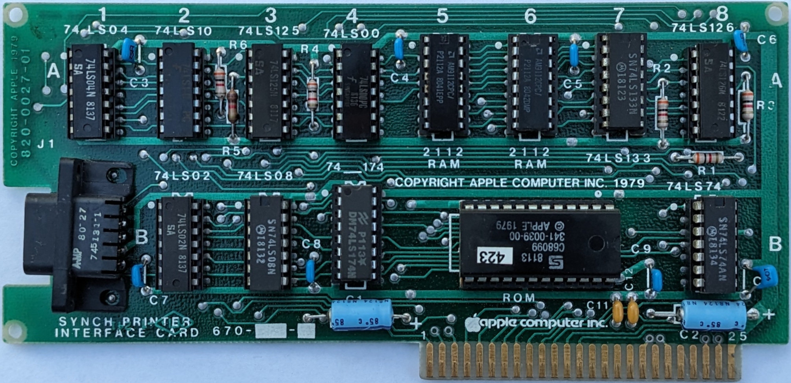
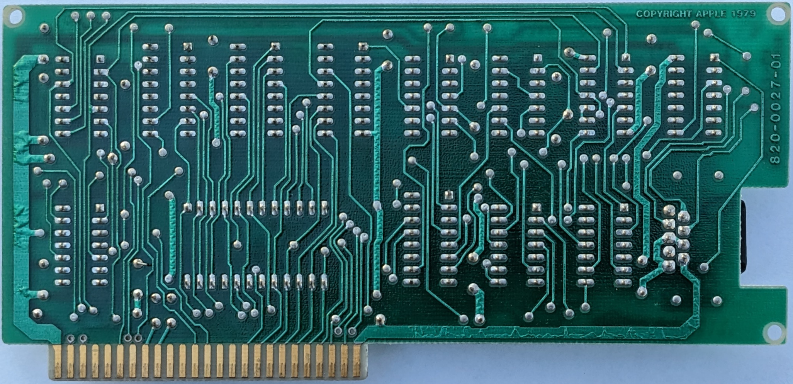

This is an Apple II serial printer card with a 2K expansion ROM. The serial protocol is non-standard and designed
to be used with a SilenType printer.

[Schematic](Schematic.pdf) | [KiCad Project & all artifacts]({{ site.github.repository_url }}/tree/main{{ page.dir }})

### Front Image

### Back Image

