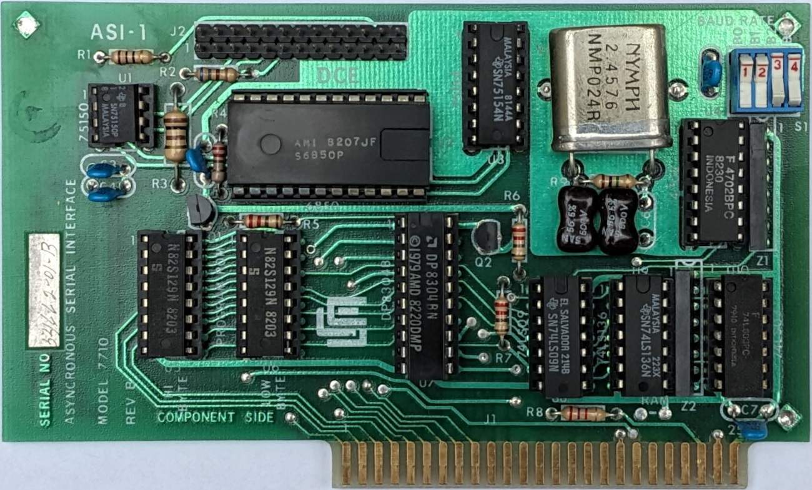
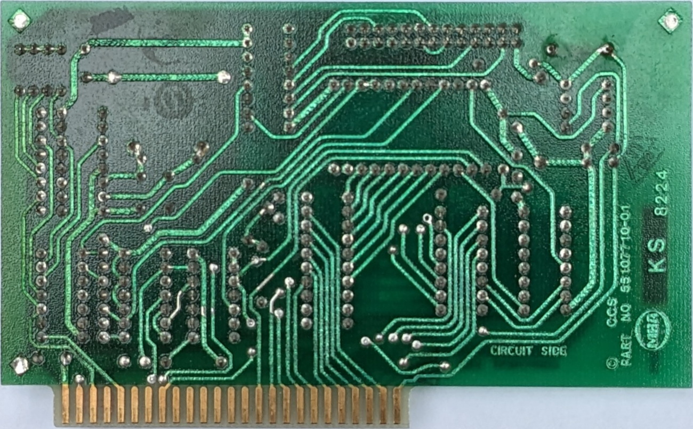

This is a serial interface card that uses the 6850 Asynchronous Communications Inferface chip. The user manual contains a
wealth of technical information about the card and how to program for it. This card has a fairly unique feature where the PROMs
can be replaced with 2112 SRAM chips so that you can `BLOAD` in patched firmware. This is required if you have outdated PROMs
and wanted to use the card in an Apple IIe. Check the manual for more detailed information.

[Schematic](Schematic.pdf) | [KiCad Project & all artifacts]({{ site.github.repository_url }}/tree/main{{ page.dir }})

### Front Image

### Back Image

