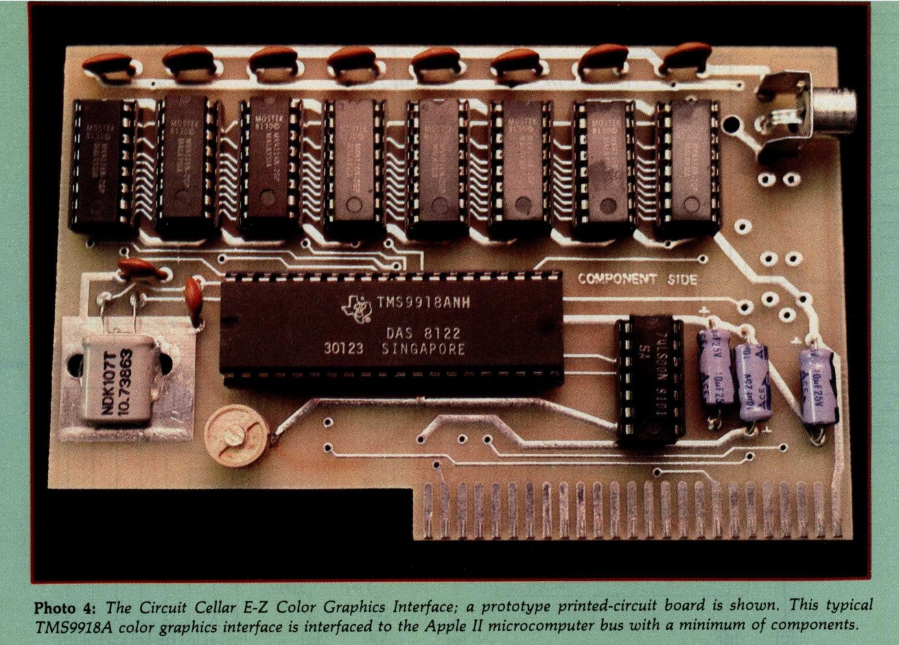

[Schematic](Schematic.pdf) | [KiCad Project & all artifacts]({{ site.github.repository_url }}/tree/main{{ page.dir }})

This card is a homebrew video card centered around the TMS9918A video chip that was published in the August 1982 issue
of Byte Magazine ([LINK1](https://archive.org/details/byte-magazine-1982-08) [LINK2](https://vintageapple.org/byte/pdf/198208_Byte_Magazine_Vol_07-08_Logo.pdf)).

### Front Image

