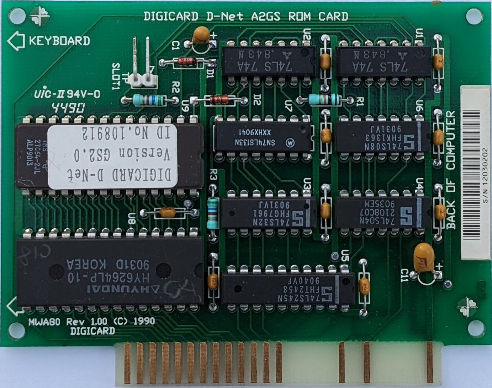
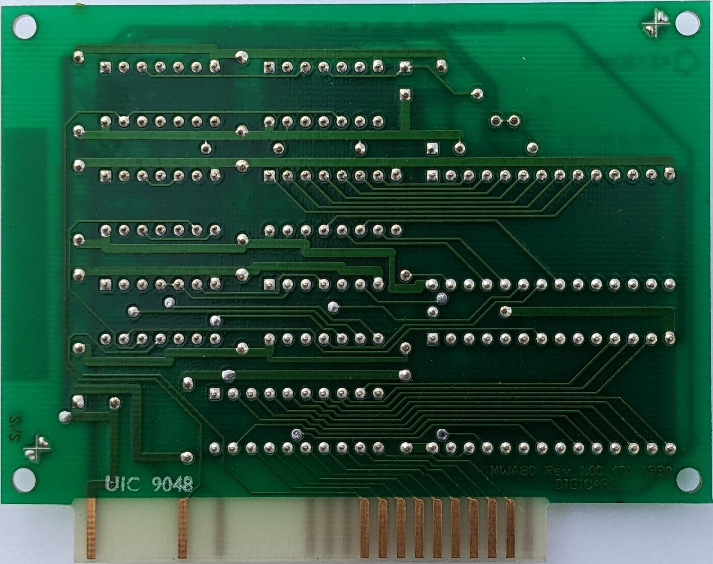
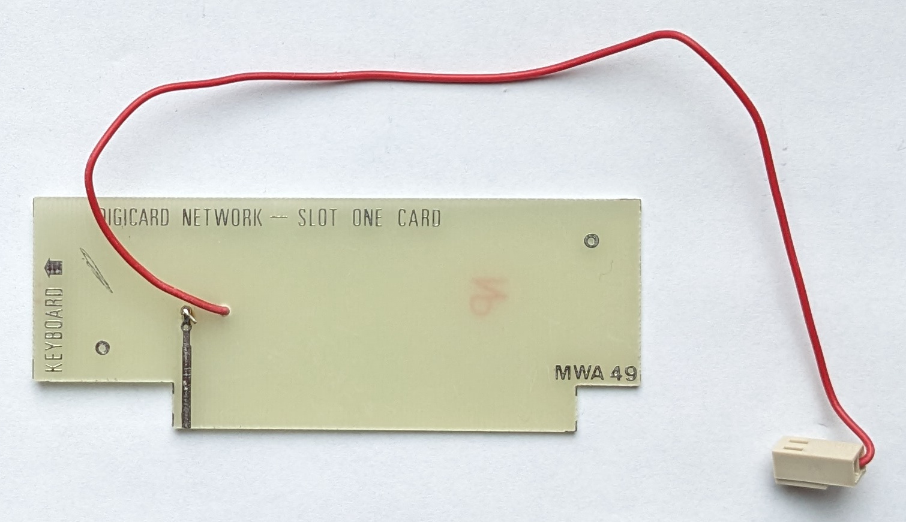

This is a simple ROM card for the Apple IIGS that contains an 8KB D-Net ROM and 8KB of SRAM. This is
similar to the [Digicard D-Net card for Apple II computers](../Digicard-D-Net) except that this card
contains no serial ports in favor of using the Apple IIGS' built-in serial ports.

Every D-Net card has a unique identifier, printed on the ROM, which is stored in the ROM as 4 bytes in
little endian byte order at offsets `0xfb4` and `0x1fb4`.

An additional pin header `TP` on the card is typically connected to pin 1 (the `/IOSEL` signal) in slot
1 using a dummy expansion card. This lets the card provide two different boot ROMs - one for the slot that
the network card is installed in to provide a network booting feature, and one for slot 1 to provide a
network printing feature.

[Schematic](Schematic.pdf) | [KiCad Project & all artifacts]({{ site.github.repository_url }}/tree/main{{ page.dir }})

### Front Image

### Back Image

### Slot 1 Dummy Card

