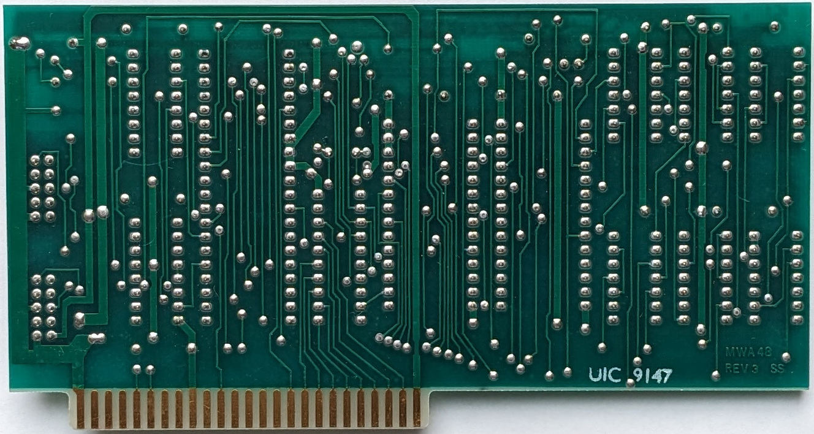

This is a network card for the Apple II that uses a proprietary protocol for sharing disks and printers.
The Z8530 serial communication controller IC is the same one used in the Apple IIgs and early Macintoshes
so could technically support Localtalk. The two serial ports on the card use differential +/-5V I/O
and can run up to 230.4Kbps.

An external box that looks almost exactly like a Macintosh Localtalk-PhoneNet box connects to the D-net
port to provide an isolated connection to the shared communcation bus on outer two wires of the phone
cables. Like all the typical PhoneNet adapter boxes, termination is not built in to the box so ends of
the line would need termination resistors installed in the empty RJ11 jack.

An additional pin header `TP` on the card is typically connected to pin 1 (the `/IOSEL` signal) in slot
1 using a dummy expansion card. This lets the card provide two different boot ROMs - one for the slot that
the network card is installed in to provide a network booting feature, and one for slot 1 to provide a
network printing feature.

The card contains an 8K expansion ROM and an 8K SRAM which are accessed through the 2K memory window at
`$C800`. One of the control lines out of the SCC is used to choose whether the ROM or SRAM should be active.

Every D-Net card has a unique identifier, printed on the ROM, which is stored in the ROM as 4 bytes in
little endian byte order at offsets `0xfb4` and `0x1fb4`.

[Schematic](Schematic.pdf) | [Box Schematic](Box-Schematic.pdf) | [KiCad Project & all artifacts]({{ site.github.repository_url }}/tree/main{{ page.dir }})

### Front Image

### Back Image

### Slot 1 Dummy Card

### Box Front

### Box Back

