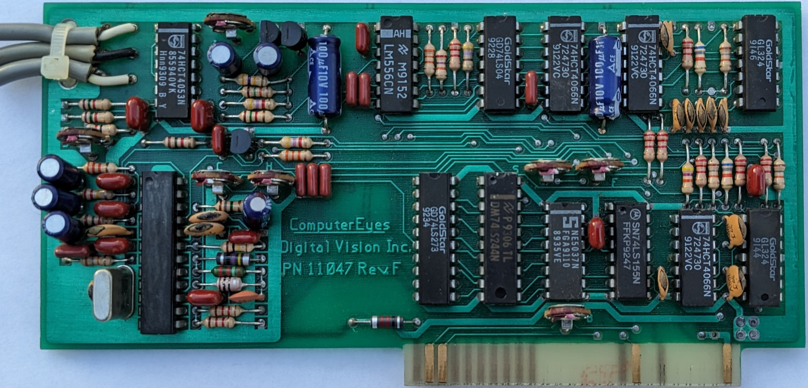
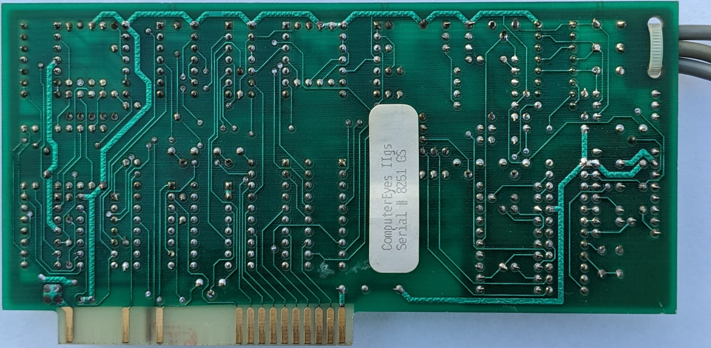

This card is a color video digitizer made for the Apple IIgs.

[Schematic](Schematic.pdf) | [KiCad Project & all artifacts]({{ site.github.repository_url }}/tree/main{{ page.dir }})

This card is basically just a simple NTSC-to-RGB converter with an analog-to-digital converter that the CPU polls
to read the video data. A full color scan is done one column at a time and takes 6 seconds to complete. Chapter 6
of the manual contains a high level description of how a capture is done.

The card itself has none of the components labeled so I took the liberty of [labeling them](front_annotated.jpg)
so the components can be linked to the schematic. There is an IC (labeled U7) that has the identifier sanded off
on all pictures of this card that I could find however I found that this IC appears to be a `TDA3330` "TV Color
Processor".

### Front Image

### Back Image

