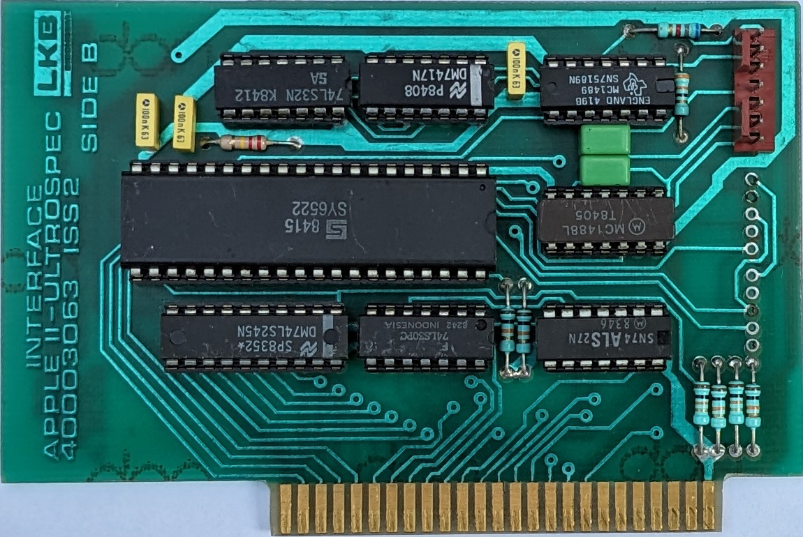
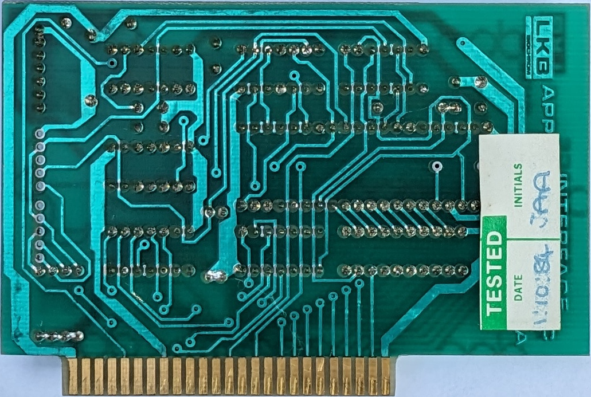

This is an interface card for an Ultrospec spectrophotometer. The card I had contained one populated 7-pin connector
and two unpopulated 5-pin connector positions which may have been used for different spectrophotometer models. The only
information I could find on this hardware is a [mention in a magazine](labmed14-0452.pdf.gif).

The components on the card are not labeled so I [took the liberty of defining some](front_annotated.jpg)
so that the board can be cross-referenced with the schematic.

[Schematic](Schematic.pdf) | [KiCad Project & all artifacts]({{ site.github.repository_url }}/tree/main{{ page.dir }})

### Front Image

### Back Image

