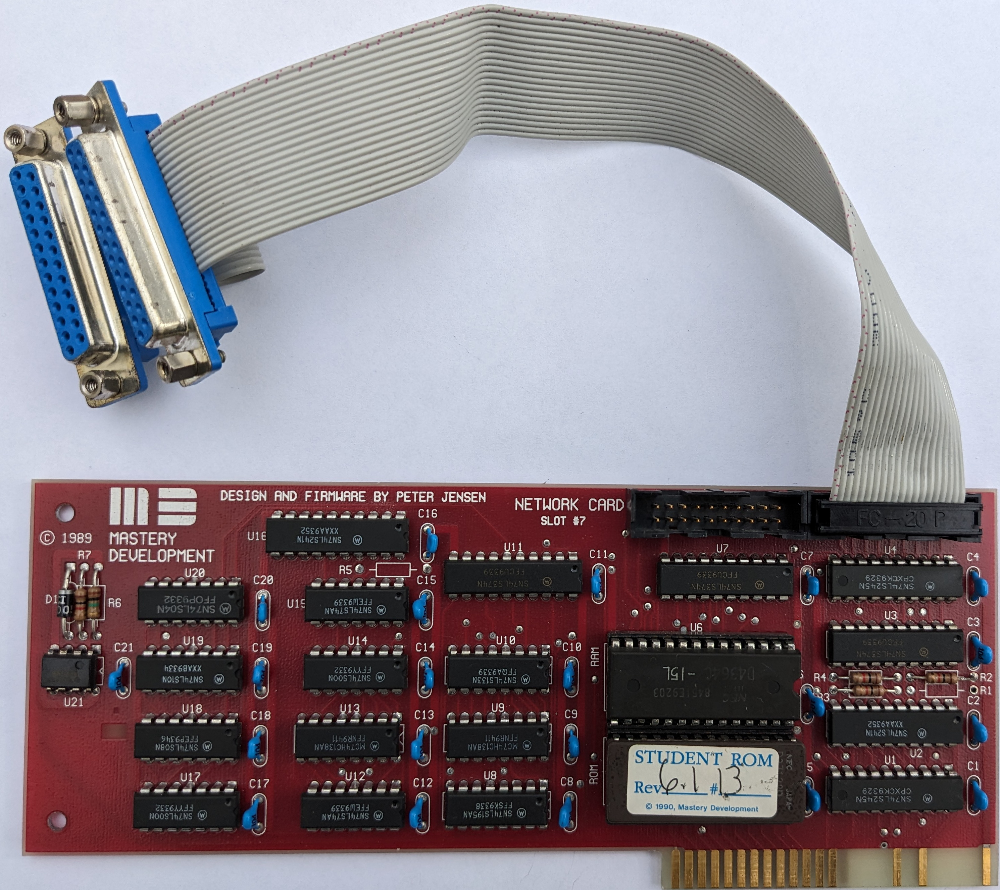
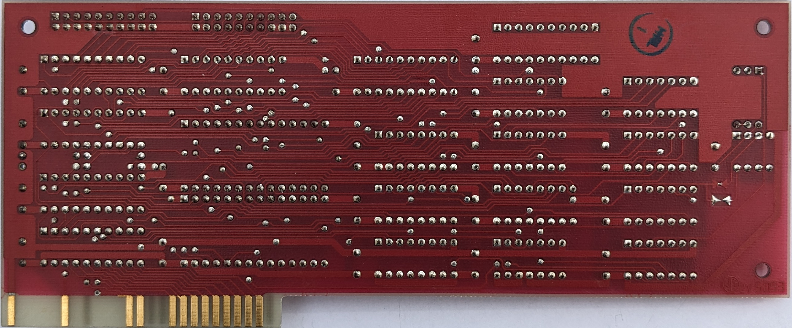
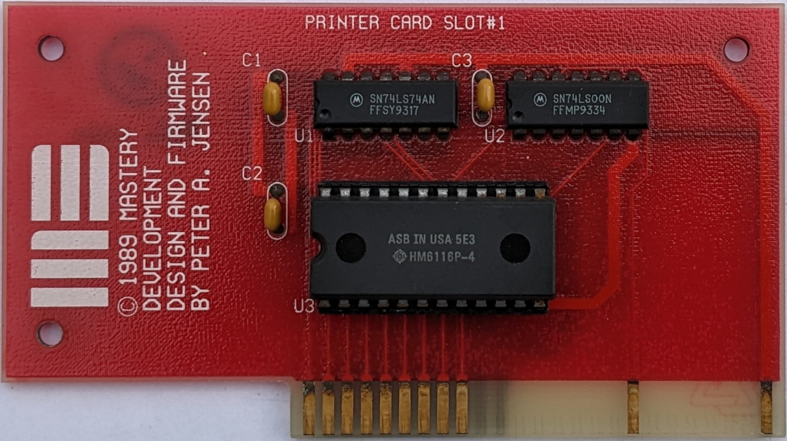
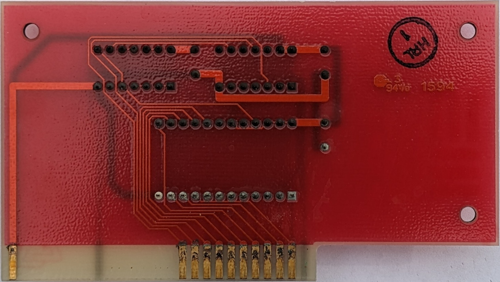

This is a proprietary networking card for Apple II computers designed for use in school classrooms to allow network booting. It
also included a second card to be installed in slot 1 for printer sharing.

[Schematic](Mastery-Development-Network-Card.pdf) | [Slot 1 Printer Card Schematic](Mastery-Development-Slot-1-Printer-Card.pdf) | [KiCad Project & all artifacts]({{ site.github.repository_url }}/tree/main{{ page.dir }})

The slot 1 printer card is very simple and just provides 256 bytes of RAM that a printer driver can be loaded into.

The network card itself has two DB-25 connectors that carries a proprietary external 8-bit bus that can be daisy-chained between computers in a classroom. Each "Student" card
in the network has a unique ID.

### Front Image

### Back Image

### Slot 1 Printer Card Front Image

### Slot 1 Printer Card Back Image

