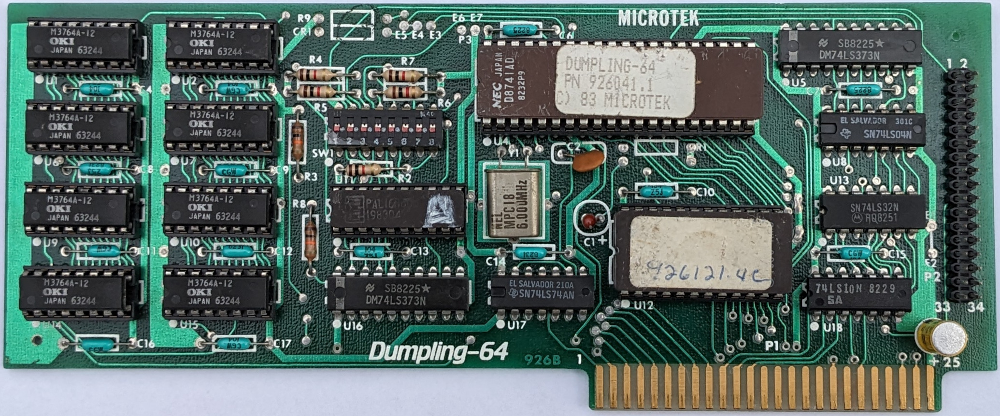
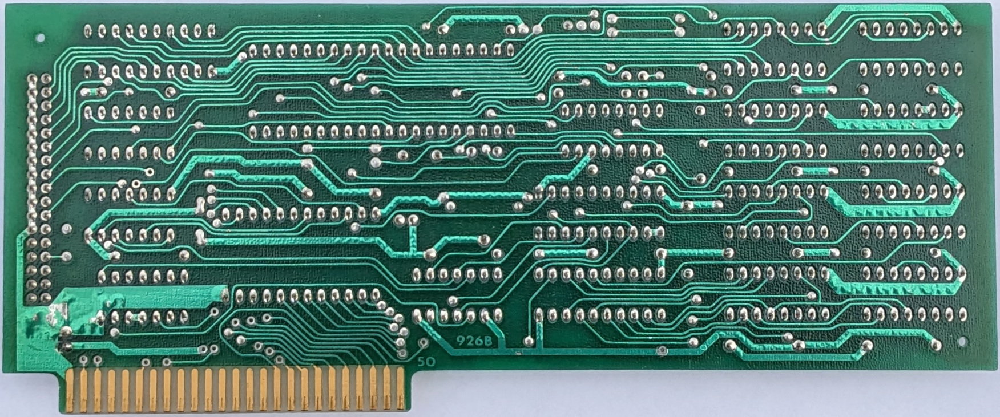

This is an Apple II printer card with a 4K expansion ROM and 64K of DRAM.

[Schematic](Schematic.pdf) | [KiCad Project & all artifacts]({{ site.github.repository_url }}/tree/main{{ page.dir }})  
[U11 truth tables](PAL16R6_U11_tables.md)

The center of the card is a 8741A microcontroller that the CPU interacts with. I don't have the ability
to dump the program ROM of this microcontroller.

The card also contains a programmable logic device, a PAL16R6. I'm unable to dump the program fuses
directly but was able to extract the observed truth tables.

### Front Image

### Back Image

