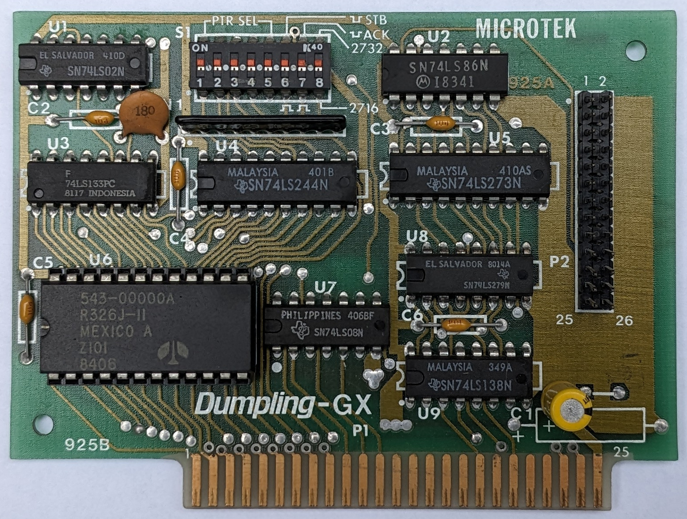
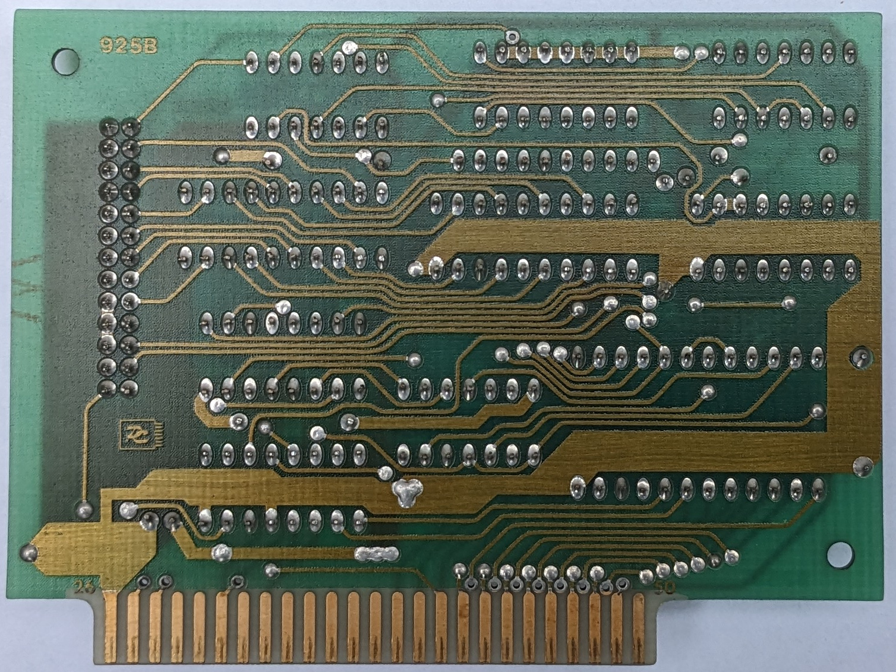

This is an Apple II parallel printer card with a ROM.

[Schematic](artifacts/Schematic.pdf) | [KiCad Project & all artifacts]({{ site.github.repository_url }}/tree/main{{ page.dir }})

### Front Image

### Back Image

