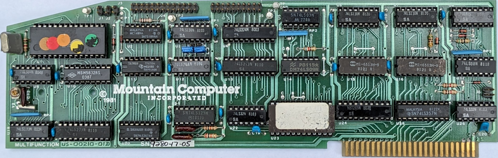
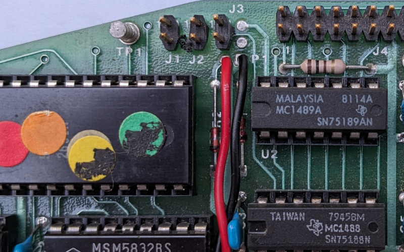
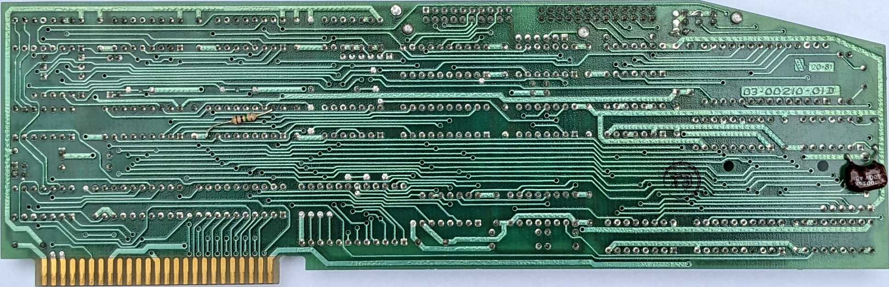

This is a multifunction card that contains a clock, a parallel port, and a serial port. There is also 256 bytes of
battery-backed SRAM that stores the card configuration. The manual is quite detailed and describes all the registers
and how to use the card's hardware directly.

[Schematic](Schematic.pdf) | [KiCad Project & all artifacts]({{ site.github.repository_url }}/tree/main{{ page.dir }}) | [Working disk images](https://mirrors.apple2.org.za/ftp.apple.asimov.net/images/hardware/io/Mountain%20Hardware%20CPS%20MultiFunction%20card.zip)

This card has the ability to make the 3 functions appear as "phantom" devices in any slot. It does this by decoding
the full address bus (instead of just using `/IOSEL`) and the output of `U25` determines if the slot being accessed
should be handled by the CPS card. The manual describes that pin header `J6` is also used with a companion board that
replaces an IC on the main logic board to help with this "phantom slot" feature.

I don't have this companion board and I can't find any pictures or information about it other than what's in the
manual. The board is supposed to replace IC `H12` on an Apple II+, which is a 74LS138 that is responsible for
generating all of the I/O select signals for each expansion slot (see page 7-6 of "Understanding the Apple II").
Based on the reconstructed schematic and wording in the manual, my guess is that this companion board is responsible
for disabling `/IOSEL` from being asserted on any slot if the phantom slot feature is already enabled for that slot
to prevent bus conflicts. I think this would only ever be useful if there was a physical card with a ROM in a slot that
was also configured to be a CPS phantom slot peripheral. This (misconfiguration) can just be avoided when setting up
the CPS card so the companion board seems to be entirely optional.

From page B-3 in the manual:

    Your CPS Card supports the ability to mask out other peripheral cards and trap their calls. This allows the
    multiple devices on the CPS Card to be mapped to slots other than that in which the CPS Card is actually located.

    This is done by using the 'USER1' line on the Apple bus. We know of no other peripherals which use this line, but
    if you acquire one you will need to understand how that line is used.

    The DIP carrier at H-12 gives the CPS Card access to the USER1 line (AFTER the jumper on the motherboard), which
    inhibits ALL peripheral cards which use I/O SELECT to activate their chip-enable lines.

    Briefly, the USER1 line, when low, pulls both DEVICESELECT and I/O SELECT high. The CPS Card uses address decoding
    but NOT I/O SELECT as chip enables. Therefore, when the USER1 line is low the CPS Card will NOT be disabled, but
    all peripheral cards which use either DEVICE SELECT or I/O SELECT will be disabled.

It should, however, be possible for a phantom slot peripheral to share the same slot as a physical card that doesn't
have a ROM, such as a Mockingboard or Digitial Vision capture card. There should be no conflicts in that case.

**Unfortunately, if you don't have the companion board connected then the signal connected to `J6` floats and the
multifunction card may randomly cause bus conflicts on accesses to all expansion slots. This manifests as expansion
cards, like the Disk II interface, just not working properly. This can be fixed by installing a 10k pullup resistor
between pins 18 and 20 of `U25` and resetting the phantom slot configuration (see the top of page B-4 in the manual)**

### Front Image

_Battery holder removed_

### Front Battery Holder Connection Image

### Back Image

_Battery holder removed_

