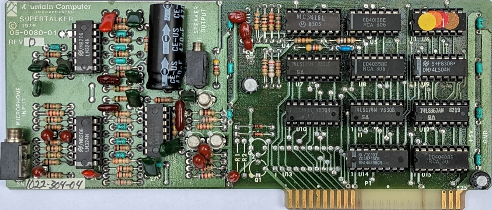
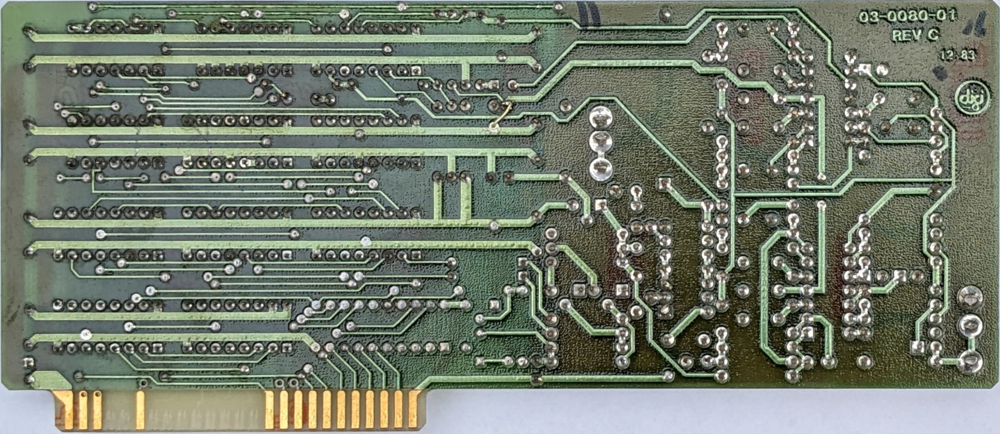

This is an interface card for speech digitization and playback. The card support 4 sampling rates; the lowest two sound quite bad but the
higher two sound acceptable.

Many of the component identifiers are hidden under the components on the board so I created an [annotated board image](front_annotated.jpg)
with the identifiers I could make out, for cross-referencing with the schematic.

[Schematic](Schematic.pdf) | [KiCad Project & all artifacts]({{ site.github.repository_url }}/tree/main{{ page.dir }})

### Front Image

### Back Image

