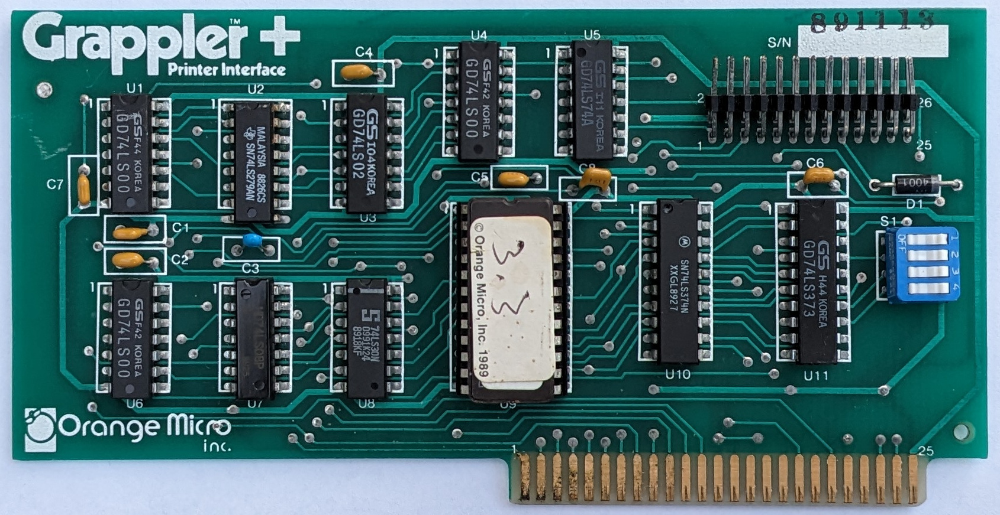
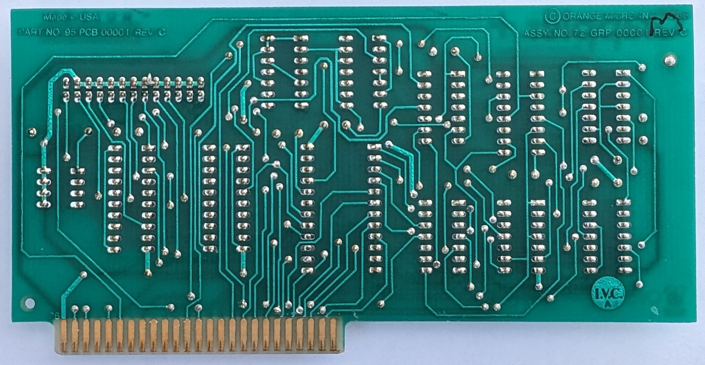

This is a newer (newest?) revision of the Grappler+ parallel printer card for the Apple II.

[Schematic](Schematic.pdf) | [KiCad Project & all artifacts]({{ site.github.repository_url }}/tree/main{{ page.dir }})

The card I have has an official "Orange Micro" sticker on the EPROM and what looks like "3.3" hand-written on it however
the EPROM contents contain the version string "3.2".

This revision fixes a couple issues with the previous revision:

 * IRQ support is completely removed to resolve reported issues with some buggy IRQ handling
 * Minor timing changes to reportedly fix compatibility with the Apple IIgs

### Front Image

### Back Image

### Updating revision A

The changes from revision A are so minor that it's possible to rework a revision A model pretty easily; you can compare
the schematics ([revA](../Orange-Micro-Grappler+/Schematic.pdf) -> [revC](Schematic.pdf)) to see the
differences. I don't have the means to test this but roughly you would:

1. Remove `Q1` and `R2` completely
2. Replace `U10` with a 74LS374
3. Cut the traces leading into `U3` pins 11, 12, & 13 so NOR gate U3D can be repurposed
4. Cut the trace leading into `U10` pin 11
5. Connect `U3` pin 11 to the Apple Bus connector pin 37 (the `Q3` signal)
6. Connect `U3` pin 12 to U4 pin 8 (the `/DOUT_SEL` signal)
7. Connect `U3` pin 13 to U10 pin 11
8. Install a 100pF capacitor, `C8`, between +5v and `U9` pin 20
9. Update the EPROM with the newer firmware
