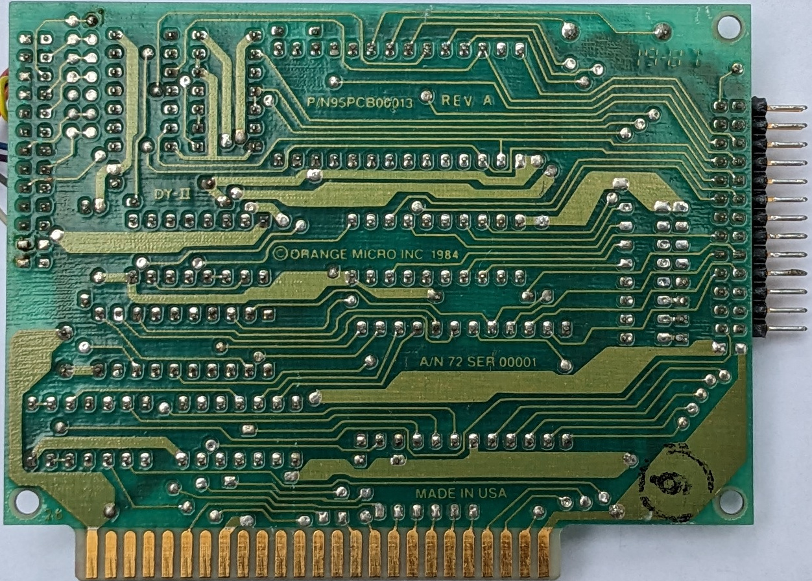

This is a serial port printer card using a 6551 serial port controller chip and all the standard control signals are brought
out to the J2 pin header.

There in an additional connector (J1) for attaching a "Bufferpak" expansion to give the card 64K of buffer memory. I don't
have one to probe but it looks like the expansion board has a dedicated Z80 processor and its built-in UART will be used instead
of the 6551 to transmit data when it is installed. The DIP switches are used to disconnect the serial transmit signals from the
6551 in that case.

[Schematic](Schematic.pdf) | [KiCad Project & all artifacts]({{ site.github.repository_url }}/tree/main{{ page.dir }})

### Front Image

### Back Image

### Front with Bufferpak installed

