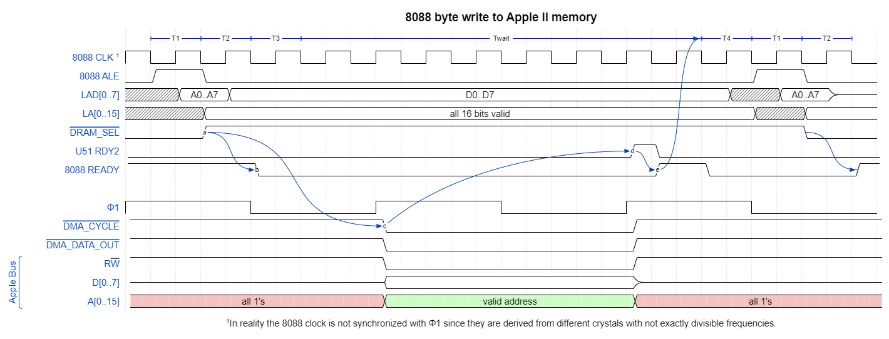
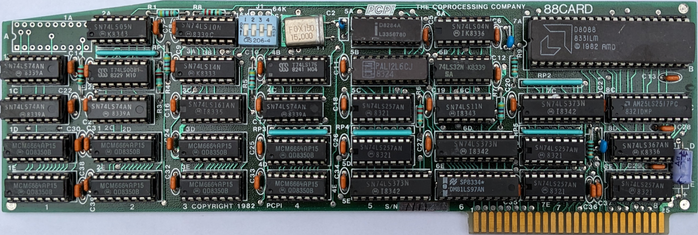
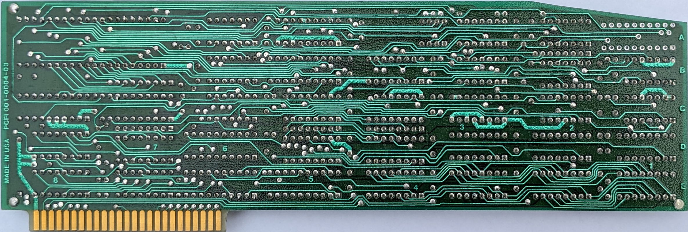

This is a CPU card with an 8088 CPU and 64KiB of dedicated RAM. Its purpose was similar to the PCPI Applicard
(Z80-based) but was much less popular. The software for this card is basically unobtainable at this point but
I've seen pictures of floppy disks for DOS and MBASIC, and according to a period ad there was supposed to also
be version of CP/M 86.

[Schematic](Schematic.pdf) | [KiCad Project & all artifacts]({{ site.github.repository_url }}/tree/main{{ page.dir }})  
[U52 truth tables](PAL12L6_U52_tables.md)

There is one control register to toggle which CPU is running (6502 vs 8088) and only one CPU may run at a time. Writing
any value to any address in the range `$Cn00-$CnFF` (where n is the card's slot number) will pause one CPU and start
the other. I suppose that the 8088 could make "calls" into 6502 code for things like disk I/O by writing an operation
number somewhere in Apple memory and then switching back to the 6502 CPU where code would inspect that operation number,
perform the operation, and switch back to the 8088 CPU.

There are four DIP switches for controlling the use of some Apple bus signals:

|   Switch   | Function |
| ---------- | -------- |
|      1     | When ON, will connect the Apple bus ~IRQ signal to the 8088 CPU so that it can process interrupts from other I/O cards              |
|      2     | When ON, will connect the Apple bus ~NMI signal to the 8088 CPU so that it can process non-maskable interrupts from other I/O cards |
|      3     | When ON, the card will respect the DMA_IN signal allowing a higher priority card to pause the 8088 CPU and take over the Apple bus. |
|      4     | unused   |

The Apple's 6502 CPU can't access the card RAM but the 8088 CPU can access both its local 64K of RAM and the Apple's
memory and I/O space. Accesses to the Apple memory are slower than the on-card RAM since the card has to insert 8088
wait states while synchronizing with the clock on the Apple bus.

A relocation program would have to run on the 8088 CPU in order to copy the 8088 code & data into the card's memory.

### 8088 Memory Map

The 8088 has a 20 bit address space. Any physical address with A16=0 will access the card's local 64KB of RAM and any
physical address with A16=1 will access the Apple's memory space. Access to the Apple memory has the high nibble mutated
by `U83` in a complex way so that the 8088 reset vector is not mapped to an address in an Apple ROM.

| Address Range | `~ADDRHI_ADJ` | `~ADDRHI_CIN` | Location Accessed            | 
| ------------- | ------------- | ------------- | ---------------------------- |
| `00000-0FFFF` |               |               | Card's local RAM `0000-FFFF` |
| `10000-1AFFF` |       1       |       1       | Apple memory `1000-BFFF`     |
| `1B000-1DFFF` |       1       |       0       | Apple memory `D000-FFFF`     |
| `1E000-1EFFF` |       0       |       0       | Apple memory `C000-CFFF`     |
| `1F000-1FFFF` |       1       |       1       | Apple memory `0000-0FFF `    |
| ...repeats... |      ...      |      ...      | ...                          |
| `FF000-FFFFF` |       1       |       1       | Apple memory `0000-0FFF`     |

### Test Program

Since the software for this card is not available I wrote a small proof-of-concept program to switch on the 8088 CPU, run a
simple test of the card's onboard memory, and write the status to the Apple text display.
The [simplemem program source code]({{ site.github.repository_url }}/tree/main{{ page.dir }}/src/simplemem) is available in
the github repo along with the schematics and other information.

### Front Image

### Back Image

