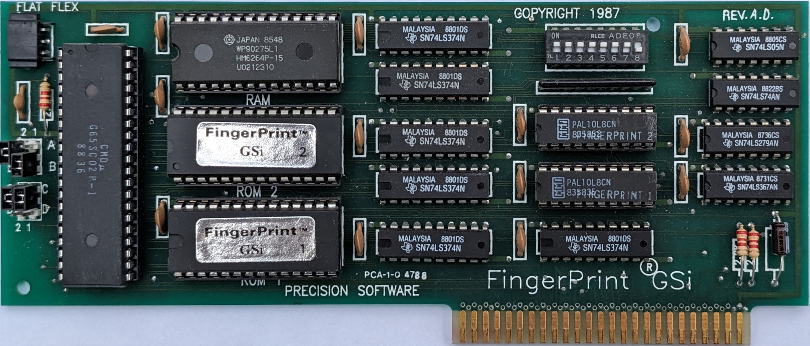
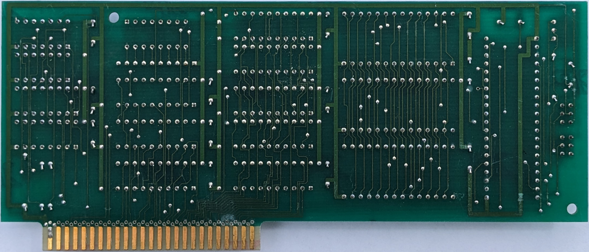

This is an expansion card for the Apple IIgs to print screen captures of any program without needing
program modifications. There is an external "fingerprint" switch that triggers the screen capture
when pressed.

The card contains a 65C02 CPU onboard along with some ROM and RAM.  My card was populated with 48KiB
of ROM and 8KiB of SRAM but the card could hold up to 128KiB of ROM and 32KiB of SRAM using banking.
It does not contain a printer interface of its own, instead printing to either one of the onboard IIgs
ports or a companion FingerPrint printer interface card.

The components on the card are not labeled so I [took the liberty of defining some](front_annotated.jpg)
so that the board can be cross-referenced with the schematic.

The majority of the logic is contained in two PAL devices labelled "FINGERPRINT 1" and "FINGERPRINT 2".
They are purely combinatorial logic so it was possible to easily dump each of their truth tables which
are included:
 * [FINGERPRINT1 truth tables](PAL10L8_FINGERPRINT1_U11_tables.md)
 * [FINGERPRINT2 truth tables](PAL10L8_FINGERPRINT2_U10_tables.md)

[Schematic](Schematic.pdf) | [KiCad Project & all artifacts]({{ site.github.repository_url }}/tree/main{{ page.dir }})

### Front Image

### Back Image

