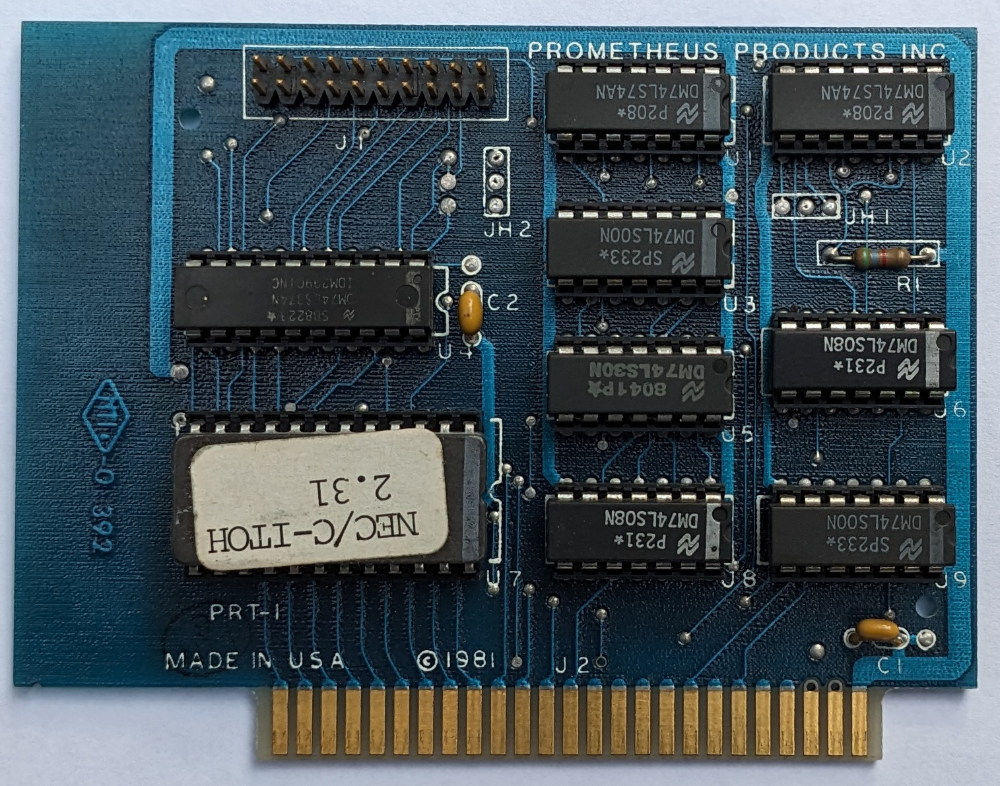
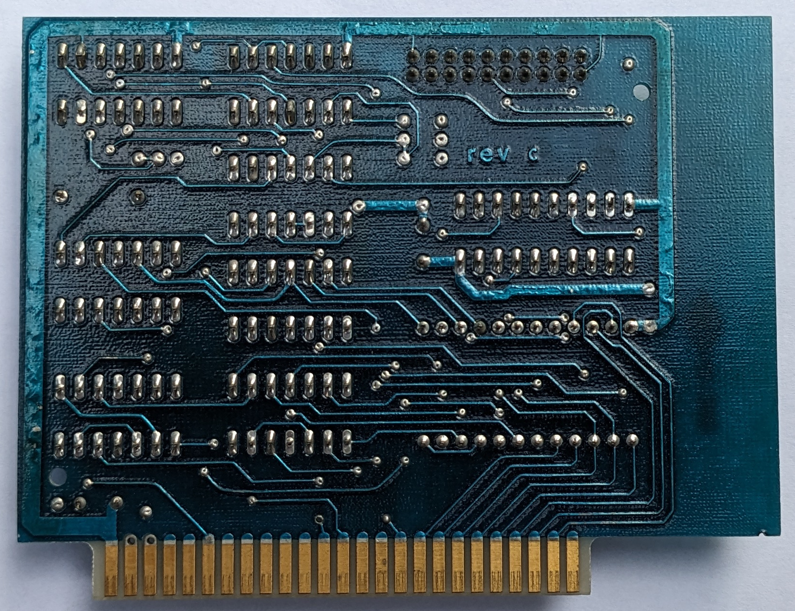
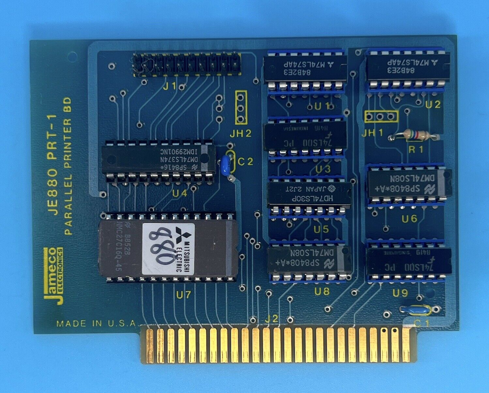
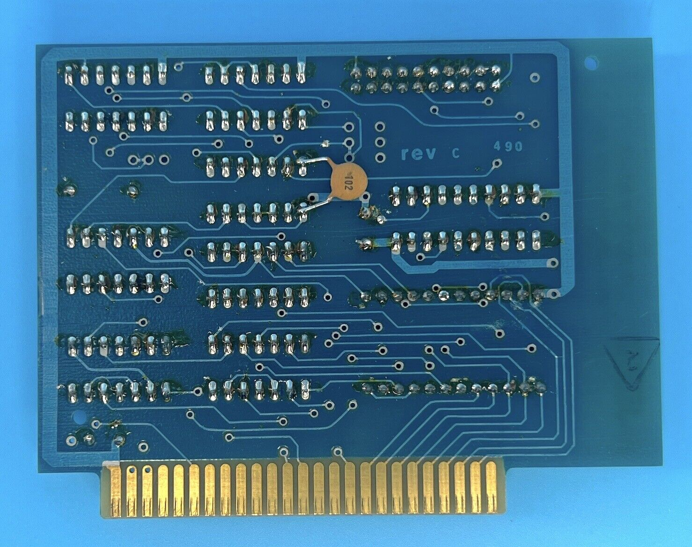

This is a generic Apple II parallel printer card with a 2K expansion ROM.

[Schematic](Schematic.pdf) | [KiCad Project & all artifacts]({{ site.github.repository_url }}/tree/main{{ page.dir }})

### Front Image

### Back Image

# Jameco JE880 PRT-1 clone

The Jameco JE880 PRT-1 card looks like the exact same design but with
slight manufacturing and assembly differences.

### JE880 Front Image

### JE880 Back Image

