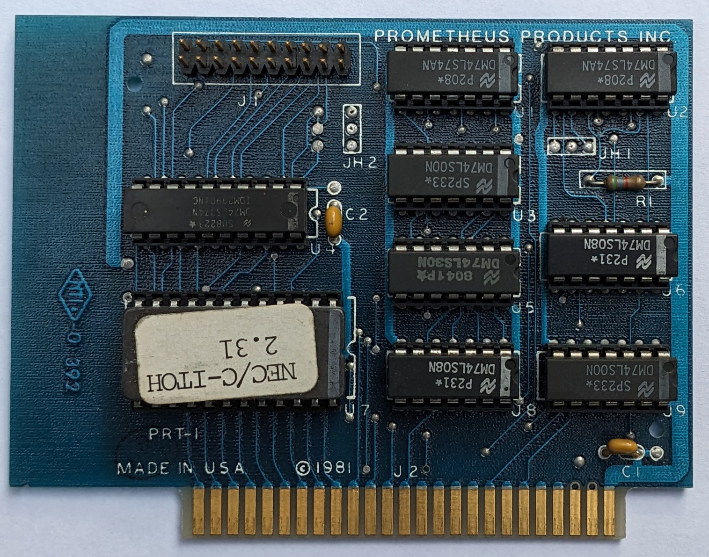
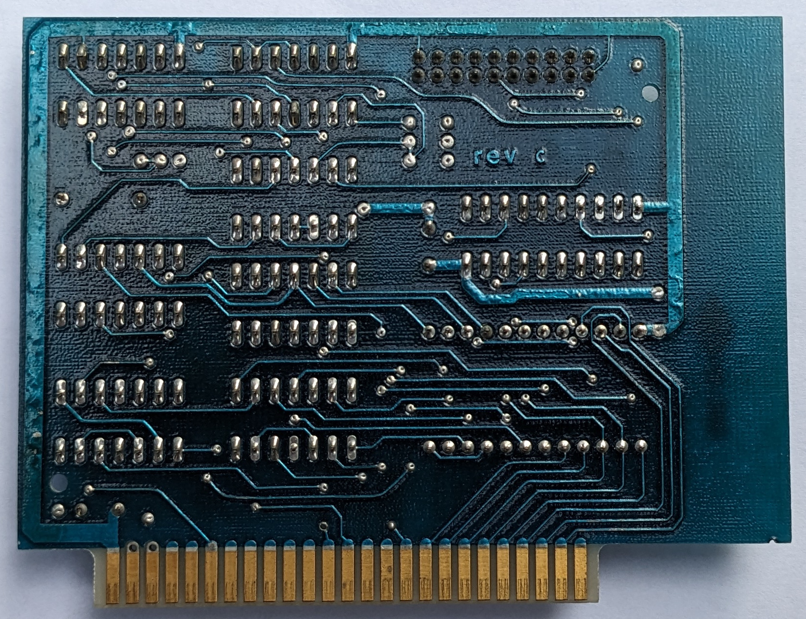
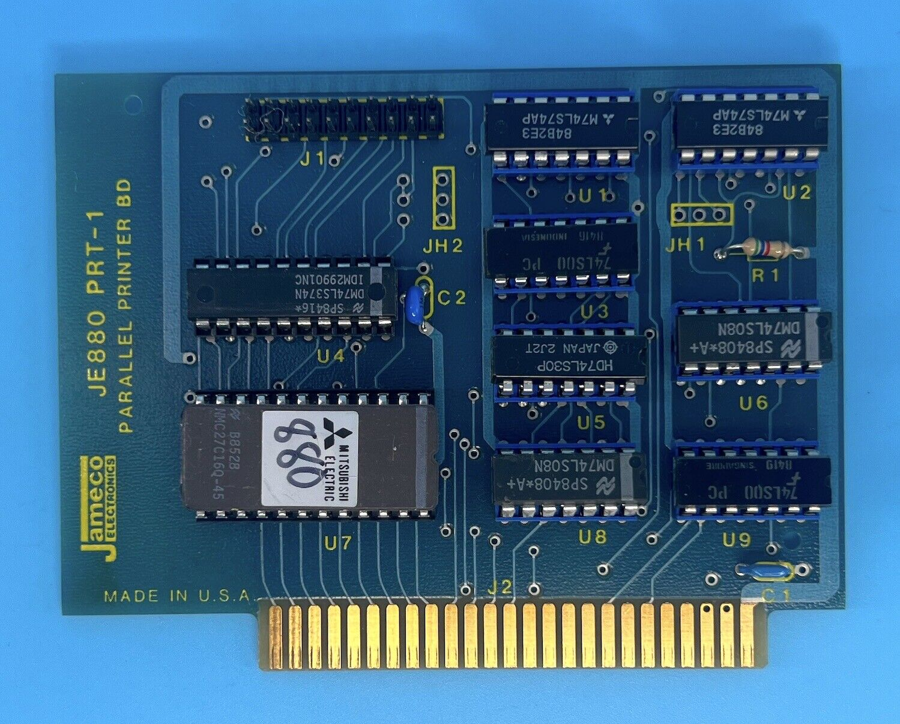
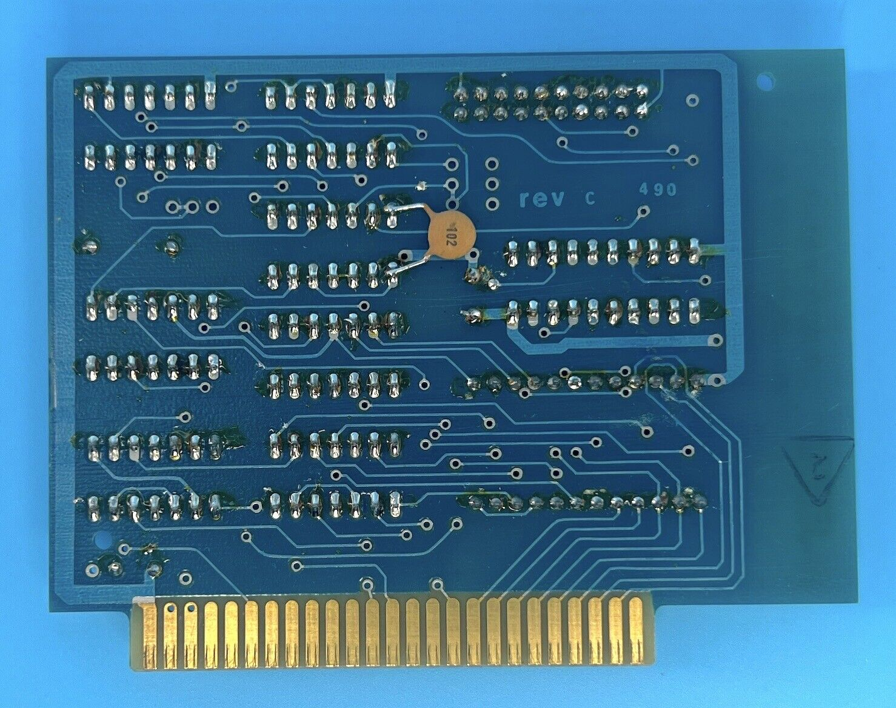

This is a generic Apple II parallel printer card with a ROM.

[Schematic](artifacts/Schematic.pdf) | [All artifacts]({{ site.github.repository_url }}/tree/main{{ page.dir }}artifacts)

**Front**

**Back**

## Jameco JE880 PRT-1 clone

The Jameco JE880 PRT-1 card looks like the exact same design but with
slight manufacturing and assembly differences.

**Front**

**Back**

