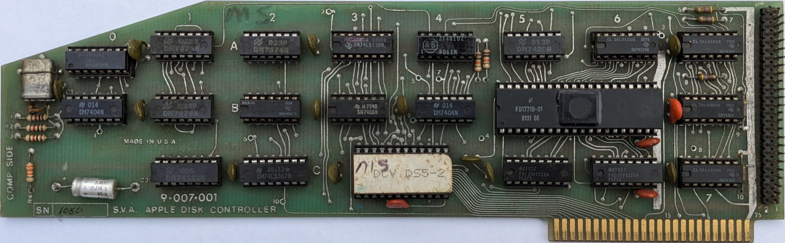
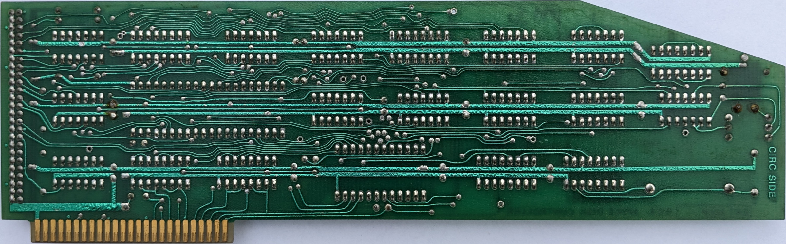

This is an 8" disk drive controller made by Sorrento Valley Associates  that uses a standard Western Digital FD1771 IC to
interface with the disk drive.

I could not find much information about this card on the Internet apart from a few pictures. I found references to another
SVA card model, the ZVX4, but that appears to be a completely different and perhaps better card.

[Schematic](Schematic.pdf) | [KiCad Project & all artifacts]({{ site.github.repository_url }}/tree/main{{ page.dir }})

The connector for the floppy drive appears to be a standard 8-inch drive connector for the period so could probably connect
to any drive. I don't have any disk drive or disks to test my card.

It looks like the card must be installed in slot 7 due to the primitive address decoding circuitry however my card didn't
appear to try to autoboot when I powered on my Apple IIe. The EPROM chip itself is a very old 2708 that uses 3 different power
rails. If the EPROM went bad then it could be replaced with a more modern single-supply 2716 _after rewiring the socket
connections on the board_ but just slapping a 2716 into the socket as-is would probably damage the chip.

### Front Image

### Back Image

