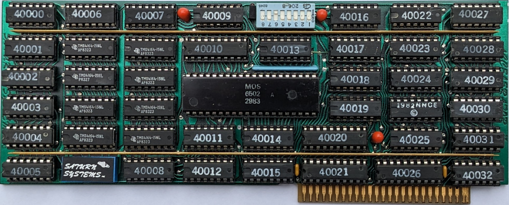

This is a CPU accelerator card for Apple II+ computers. It contains a dedicated 6502 CPU that runs at 3.5MHz and
64K of onboard RAM that can run at the CPU's full speed. To software, the 64K of memory looks like a regular 48K
Apple II+ with a language card installed for the extra 16K.

All of the logic ICs on the card have their labels sanded off, probably to thwart clones back in the day, but I was
able to individually check each IC's function on a breadboard and ended up with a schematic that makes sense. I assumed
all the TTL logic chips were LS family chips but that could be wrong. It's difficult to tell apart logic families without
the labels.

[Schematic](Schematic.pdf) | [KiCad Project & all artifacts]({{ site.github.repository_url }}/tree/main{{ page.dir }})  
[U35 truth tables](1982NNCE_U35_tables.md)

### Special Components

This card has a few specialy components that I haven't seen on any other Apple II cards.  First of all there are two
CAPBUS strips, which are long SIP packages containing 36 decoupling capacitors plus bussing to distribute +5v and GND
along the entire strip. The pins alternate connections between the two power rails so distributing power to all the ICs
on the board is just a matter of pulling from the nearest CAPBUS pins.

Another special component is the blue rectangular component in the lower left of the card with the Saturn Systems label
stuck on top, labeled `DL1` in the schematic. This component is a digital delay with multiple output taps. One pin accepts
an input and the other pins will output the signal after precise nanosecond-level delays. I measured the propagation delay
from the input to the various output pins with a 100MHz oscilloscope. For L->H transitions I measured using a threshold voltage
of 2.7v and for H->L transitions I measured using a threshold voltage of 0.7v - meaning once the input voltage reaches the
threshold voltage, the time until the output signal reaches the same threshold voltage. Pins are numbered using the same
scheme & orientation as the surrounding ICs.

|               | Delay L->H | Delay H->L |
| ------------- | ---------- | ---------- |
| Output pin 4  |    45 ns   |    54 ns   |
| Output pin 6  |    96 ns   |   108 ns   |
| Output pin 8  |   120 ns   |   132 ns   |
| Output pin 10 |    72 ns   |    82 ns   |
| Output pin 12 |    21 ns   |    28 ns   |

The final specialty component on this card is the IC with "1982NNCE" printed on it, labeled U35 in the schematic. This seems
to be a 74187 custom masked ROM that is used to condense some logic, similar to a PAL or GAL logic array. I saved the binary
contents to a bin file and also analyzed it to construct the [minimal truth tables](1982NNCE_U35_tables.md) for each output bit.

### Manufacturing Defects

The card that I obtained was non-functional due to what I consider a manufacturing defect. On it, all of the IC socket pins stuck
out the back of the board much farther than the solder; the pins were not trimmed after soldering. Because of that, all of the
socket pins could bend a good amount to the point where they could touch nearby pins. I guess over time that people put the card
pin side down on a table and any pressure on top caused the untrimmed pins to bend.

I found one shorted connection on my card and once I bent the pins back straight the card was working again.

### Front Image

### Back Image

