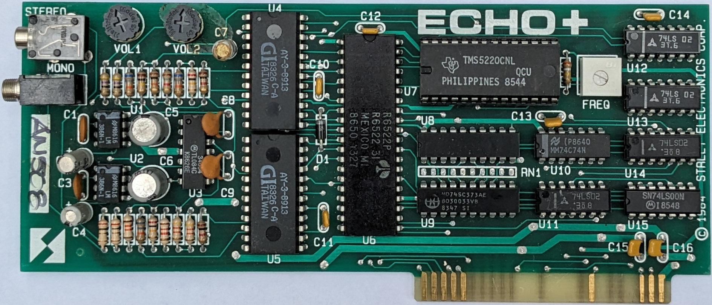
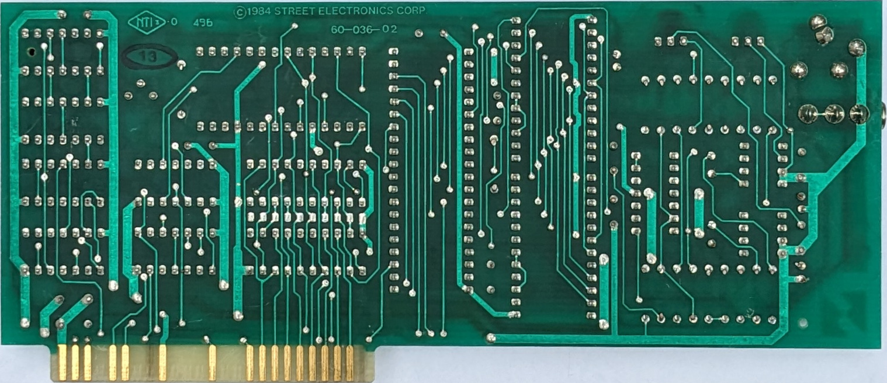

This is an Apple II sound card containing two AY-3-8913 Programmable Sound Generator chips and a
TMS5220 Speech Synthesizer chip.

[Schematic](Schematic.pdf) | [KiCad Project & all artifacts]({{ site.github.repository_url }}/tree/main{{ page.dir }})

### Front Image

### Back Image

