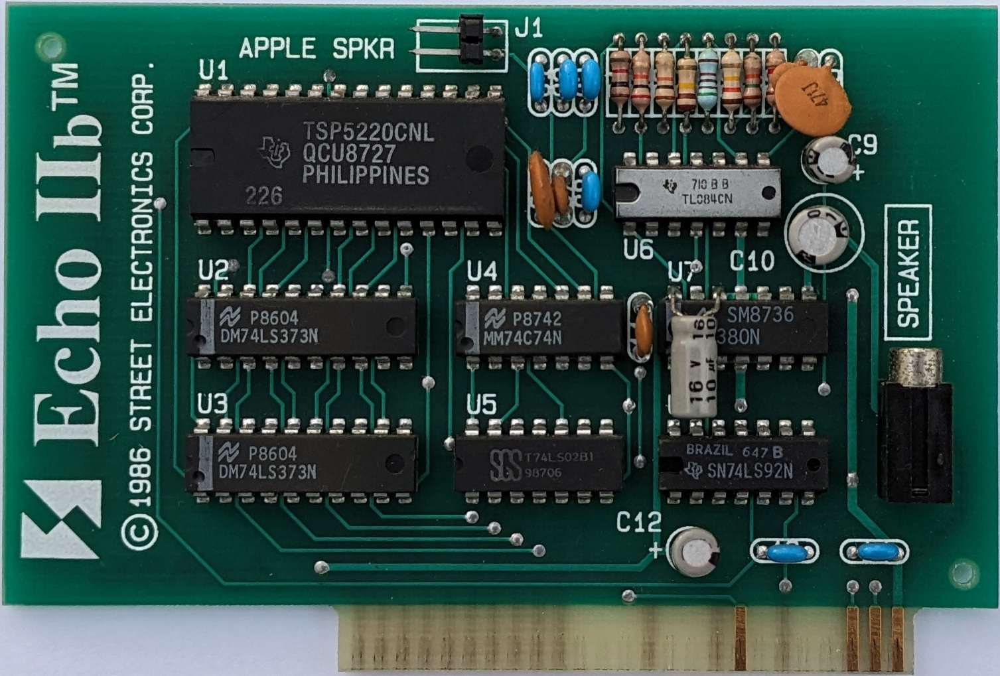
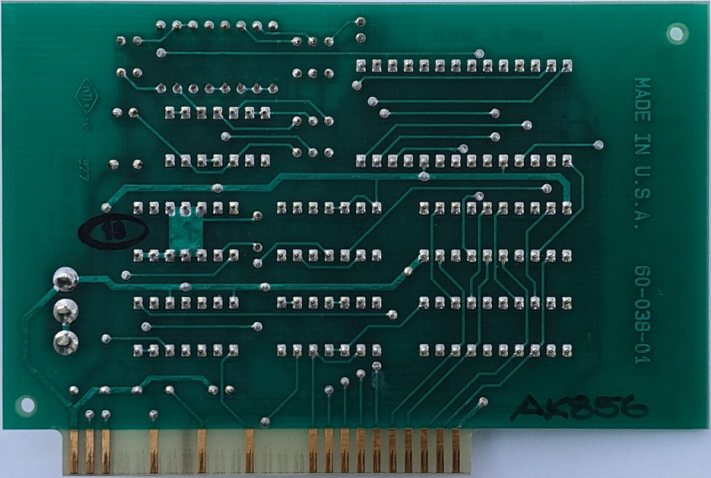

This is an Apple II speech synthesizer card containing a TSP5220 speech synthesis chip. The TSP5220 should just be a
relabeled TMS5220, according to Wikipedia, so it should function the same.

[Schematic](Schematic.pdf) | [KiCad Project & all artifacts]({{ site.github.repository_url }}/tree/main{{ page.dir }})

### Front Image

### Back Image

