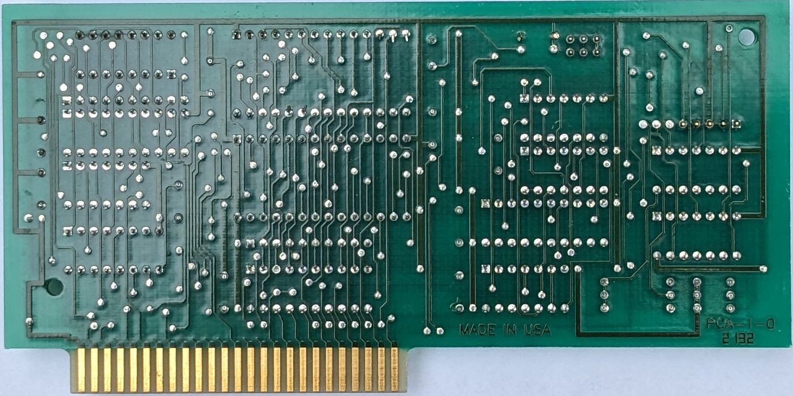

This is a serial port printer card for the Apple II with a 16K expansion ROM. The card uses a standard 6551
serial port controller chip and all the standard control signals are brought out to the J2 pin header however
most of them are not populated with pins.

The components on the card are not labeled so I [took the liberty of defining some](front_annotated.jpg)
so that the board can be cross-referenced with the schematic.

[Schematic](Schematic.pdf) | [KiCad Project & all artifacts]({{ site.github.repository_url }}/tree/main{{ page.dir }})

### Front Image

### Back Image

