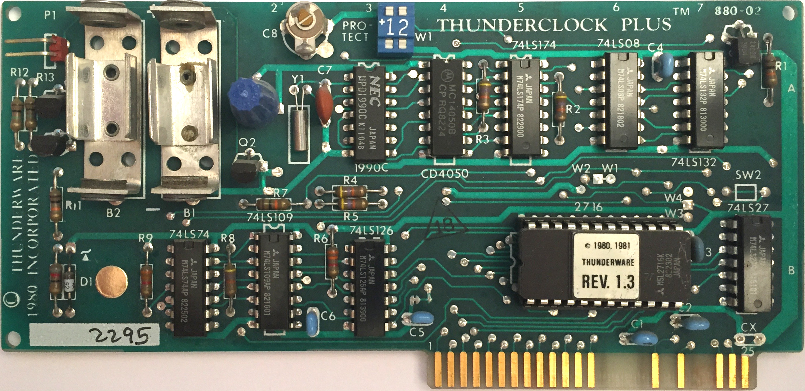
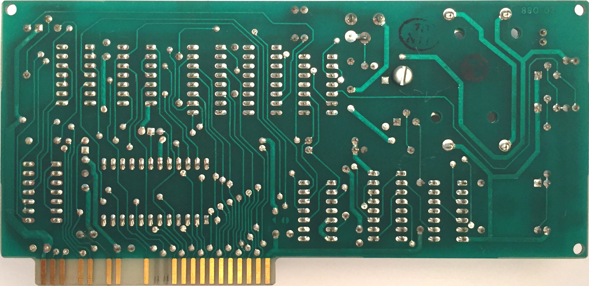

This is a realtime clock card for Apple II computers. It uses two N type batteries to keep the clock running while
the Apple II is powered down.

[Schematic](Schematic.pdf) | [KiCad Project & all artifacts]({{ site.github.repository_url }}/tree/main{{ page.dir }})  

### Front Image

### Back Image

